# Cómo exportar el proyecto y adaptarlo a tu propio coro  

Esta es una app para cantar las canciones del coro, para una celebración dominical (misa).  
Este código está adaptado al cancionero del coro 'Coro 9', que he usado para la aplicación.  
El uso es muy sencillo: todas las personas que accedan a la web o dispongan de la app verán las **canciones previstas** para la misa.  
No debe actualizar ni hacer nada más: sólo abrir la app, y ya podrá seguir los cantos de ese día.  
Además, con un botón se muestran (se ocultan) los __acordes para guitarra__, lo que facilita el acompañamiento musical.

Lógicamente, la app se complementa con una aplicación "auxiliar", que permite cambiar la lista de canciones de la celebración, las que ve todo el que use la aplicación de coro. Esta app auxiliar sólo debe manejarla el 'coordinador del coro'.  

Siguiendo esta guía podrás **adaptar el código a tu propio coro**, parroquia, etc.  

# Como adaptar el código y crear tu propia app  
En las siguientes secciones se cuenta cómo hacerlo.  
## Copiar el proyecto en tu propio directorio  
Vamos a usar el ejemplo de la parroquia de Castilleja, que quiere crear su propia versión de la app Coro.  
Tienes dos opciones: 
 - Usar GitHub: puedes crear un Fork del repositorio, y hacer los cambios en tu versión del proyecto;  
 - Usar otro dominio/directorio: para hacer los cambios y publicar el proyecto.  
 ### Si usas GitHub:  
Esta opción facilita la creación y mantenimiento de una versión para móvil.  También es adecuada si sois varios programadores.   
 Crea un fork del proyecto y realiza los cambios que se describen a continuación, directamente en los ficheros de tu proyecto.  
 ### Si usas otro directorio:  
Usaremos un dominio de neocities.org, que permite crear sitios web basasdos en Html, CSS y Javascript, gratis.  
>Crea tu cuenta, y podrás tener una versión como la siguiente:  
https://pilgrim.neocities.org/coros/castilleja/www/index.html  

Pero puedes adaptarlo a otro sitio, otro dominio, e incluso usar tu propio PC.  

Desde el repositorio del proyecto en GitHub, https://github.com/luisgentil/coros/, descarga el proyecto como un *.zip.  
Descomprime los ficheros en una carpeta del disco duro.  
Desde tu dominio en neocities, "Edit site", crea una carpeta con el nombre de tu coro; desde ahí, pulsa "Upload" y sube tu carpeta descomprimida.  

>Si todo ha ido bien, al acceder a  
https://[TU_CUENTA].neocities.org/[TU_CORO]/www/index.html  
debes ver la pantalla de inicio de la app de coro genérica.  

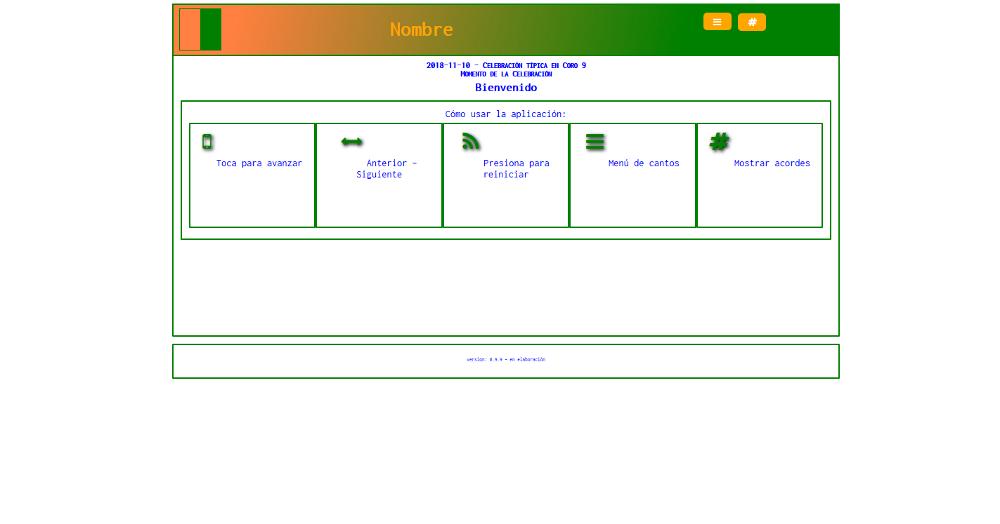  

## Adaptar la base de datos  
Para mostrar los datos de tu coro, debes **conectar la app con tu propia base de datos**.   Nos apoyamos en una base de datos on-line, que almacena la lista de cantos prevista para la próxima celebración. Esta base se aloja en Firebase, una aplicación de Google.  
Debes crear una base de datos en Firebase. Accede a la consola de Firebase, y elige *"Añadir proyecto"*; lo más fácil es elegir un nombre tipo 'coro-mi-coro', o algo parecido.  
Una vez creado, elige *"Database" > "Crear base de datos" > "Empezar con el modo de prueba"*.  
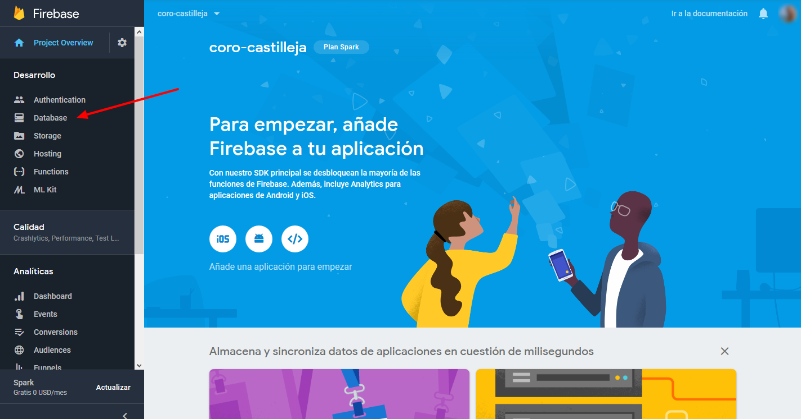  
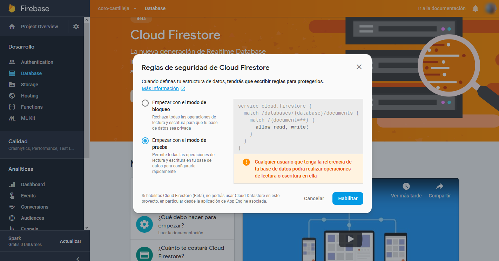  
Elige *"Realtime database"*.  
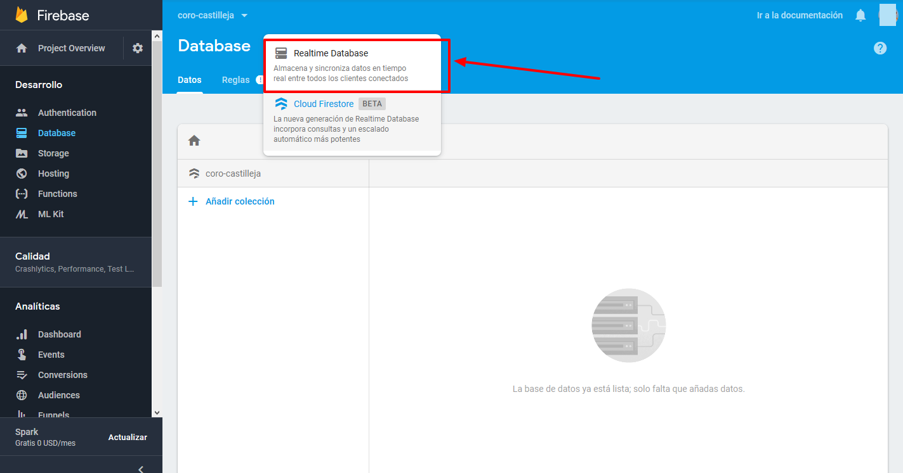  
En la carpeta *'Resources'* tienes un fichero llamado *"coro-TU_CORO-import.json"*, impórtalo desde la opción *"importar JSON"*.  
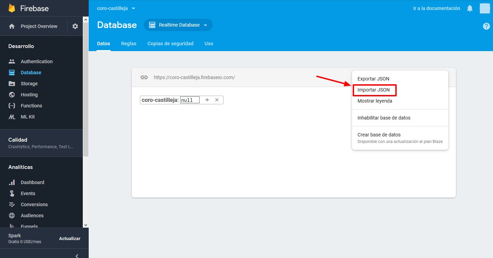  
Si la importación es correcta, debe quedarte algo así:  
 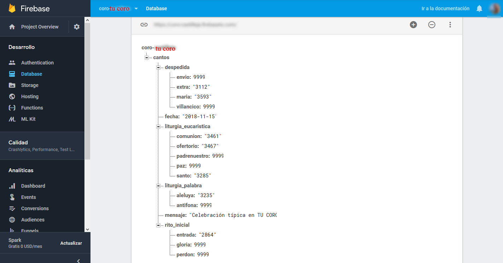  

Ahora **vamos a conectar** la aplicación web con la base de datos en Firebase. Para eso necesitamos algunos parámetros de la base de datos, que se obtienen desde el apartado *'Project Overview' > 'Settings'*:  
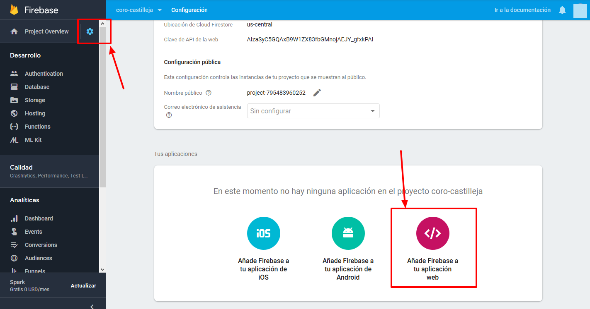  
Copia esos valores o haz una captura.  
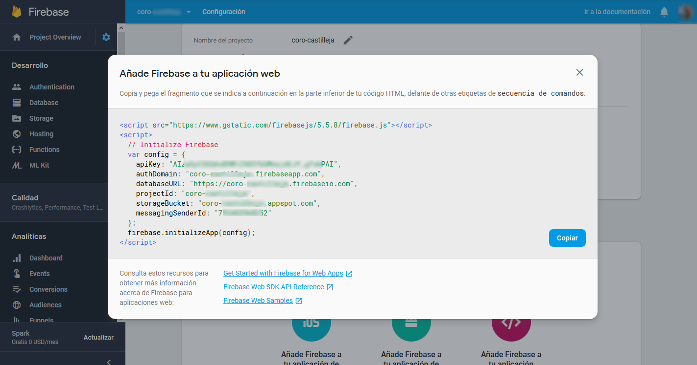  
Ahora, desde un editor de código (o si no tienes, un editor de texto), o desde la opción *'Edit'* si estás en Neocities, debes añadir los valores en tu fichero *'index.html'*, en las líneas 13 - 20.  
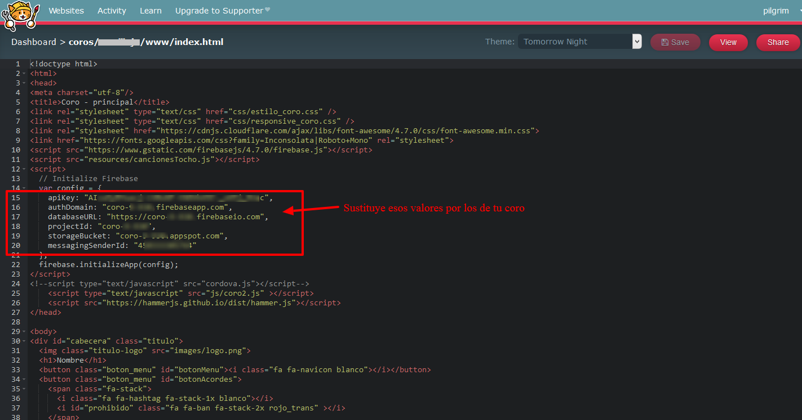  
Debemos asegurar que la base de datos permite la lectura; para eso, accede a la pestaña *"Reglas"* y comprueba los valores:  
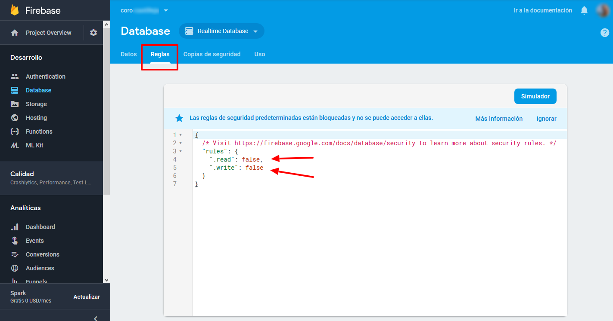  
En el caso anterior, no es posible leer ni escribir. Hay que modificarlo, pulsando en *'read: false'*, y escribiendo: **'true'**. Después, pulsa en *'Publicar'*.  
Si todo ha ido bien, y tu proyecto está en Neocities, al acceder a   https://[TU_CUENTA].neocities.org/[TU_CORO]/www/index.html debería actualizar los datos a los que están en tu base de datos, que si no has modificado tendrán este aspecto:  
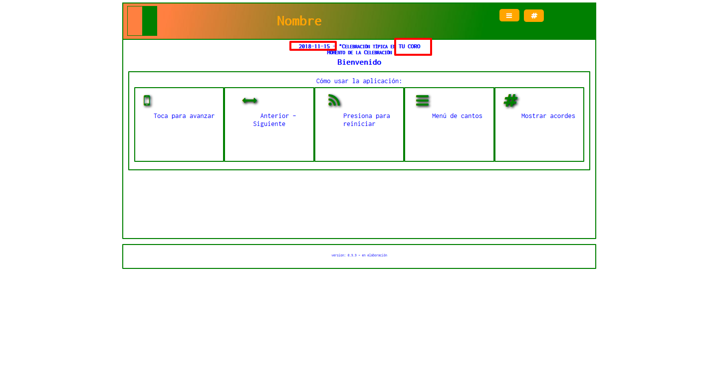  

## Cómo cambiar los contenidos de cada domingo
Esta aplicación web está pensada para que, cada domingo, los usuarios sólo tengan que abrir su aplicación en el móvil, y comenzar a cantar los cantos de esa celebración.  
Lógicamente, *'alguien' tiene que actualizar los cantos*, cada semana. Esa función está asignada al **'coordinador de coro'**.  
La actualización puede hacerse de dos formas, una difícil y otra fácil.  
La forma difícil consiste en: acceder a la consola de Firebase, acceder a 'Database', después a 'Realtime Database', y actualizar los campos de cada canto con el código numérico correspondiente al ID de cada canto, en el cancionero El Tocho, del Coro 9 (ver fichero 'resources/cancionesTocho.js'). Evidentemente, es poco práctico.  
La **opción fácil** consiste en adaptar y usar la aplicación web de Coordinador de Coro, que tiene el listado de cantos de cada sección, elige y graba fácilmente.  
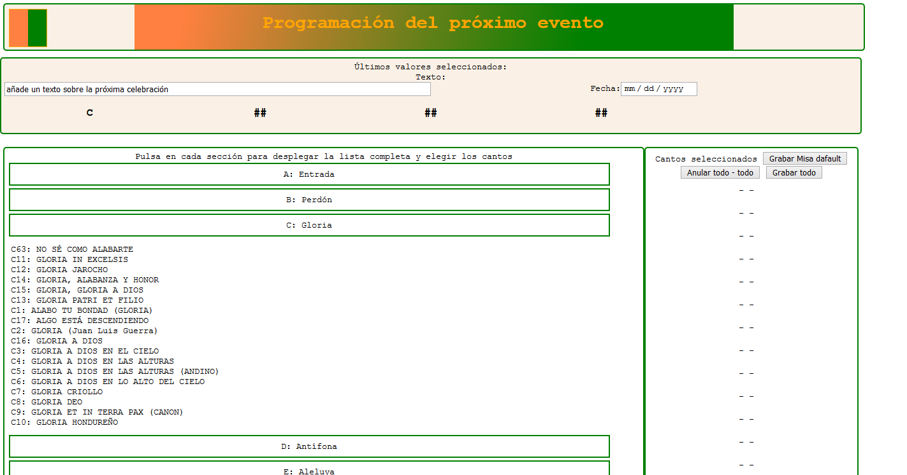  
Para adaptar esa aplicación lee la sección siguiente.  

## Adaptar la aplicación web del Coordinador de coro  
Para utilizar la web de coordinación hay que conectarla con la base de datos de tu coro, y otorgarle permisos de escritura.  
**Conexión**: actualiza los valores de los parámetros de la base de datos, en las líneas 15-20 del fichero *'index_coordinador_coro.html'*.  
**Permisos de escritura**: modifica la regla de seguridad, *'write: true'* para dar permisos de escritura. 
>**Pero antes, lee la sección siguiente sobre seguridad de la base de datos.** 


Otros cambios, como el aspecto y tal, se tratan en secciones posteriores.  

## IMPORTANTE: Seguridad de la base de datos
Debido a la vida misma, (falta de tiempo, sobre todo; pero también, **ley de protección de datos** y similares) el diseño de esta web-app se basa en dar permisos completos de lectura en la base de datos; así no hay que tener usuarios registrados, ni hace falta guardar datos de los usuarios para leer y usar los datos; pero TAMBIÉN IMPLICA que cualquiera que tenga los datos de acceso a la base de datos (ahora mismo, todo el que tenga la app) puede modificar los datos.  
ATENCIÓN: esto es peligroso, mientras no modifiquemos el código para obligar a estar identificado.    
Una solución 'fácil' para controlar la escritura en la base de datos es la siguiente:  
- establecer la regla de permiso de escritura a 'false'; de este modo, cualquiera puede leer pero no escribir.  
- Cuando el coordinador quiere actualizar la lista de cantos:
	- accede a la consola,  
	- modifica la regla de escritura a *'true'*,  
	- actualiza la lista de cantos mediante la web app de Coordinación,  
	- comprueba que está bien,  
	- y vuelve a cambiar la regla a *'false'*.  

## Adaptar el aspecto y las imágenes de la web/app de Coro  
EL '**Nombre del coro**' se modifica en el archivo *'index.html'* (usa *buscar* y *sustituir*).  
### Aspecto
Colores, etc: La web app usa dos archivos css para controlar el aspecto, que están en la carpeta *'css'*.  estilo_coro.css, responsive_coro.css .
A continuación se destacan los cambios más sencillos para personalizar el aspecto.  
```
- Tipo de letra general: 	body, font-family;  
- Tamaño de letra general:	body, font-size;  
- Borde general: 			div, border:  
			grosor			2px  
			estilo			solid  
			color			purple;  
Esquinas redondeadas:		div, border-radius: 10px;  
Nombre:						.titulo h1,  
			color			color: white;  
			border 			border: 2px solid purple;  
```
No es difícil adaptar alguna característica distinta a las anteriores. Utiliza las '*Herramientas para desarrolladores*' de tu navegador (Mozilla, Chrome, lo típico es pulsar la tecla F12), usa la herramienta '*Inspector*', sitúa el cursor sobre el elemento que quieres modificar y haz clik en él; en la pantalla auxiliar aparece la lista de características que se están aplicando, localiza la que te interesa y qué clase es la que está estableciendo el valor; busca la clase en el fichero css correspondiente y cambia al valor que te interese.  

### Imágenes
```
Cabecera, 	tamaño 950 x 100 px. Archivo '/images/header.jpg'.  
				Logo, 		tamaño  60 x  60 px. Archivo '/images/logo.png' .  
```

### Adaptar aspecto e imágenes de la aplicación de oordinación de coro  
El fichero que controla el aspecto es '*estilo_coro_desk.css*', los valores son similares a los del apartado anterior.  
El esquema de carpetas es similar, pero están aparte para evitar confusiones y/o difusiones involuntarias.  

## Crear una app de Android  
Lo 'ideal' es crear una aplicación para móviles, que puedan usar los asistentes a la celebración cada domingo. Tan solo hay que abrir la app y *¡voilà!* ya aparece la lista de cantos que se van a usar, y solo esos cantos,... siempre que el coordinador lo haya actualizado antes, por supuesto ;).  
Usando **Phonegap** es muy fácil crear aplicaciones de móviles que emplean html, javascript y css, es decir, como este proyecto.  
Por esa razón, con los ficheros de este proyecto es muy fácil crear una app para Android; pueden crearse versiones 'debug' (de pruebas) **gratuitamente**, y distribuirlas mediante código bidi, subiendo el fichero a otra web, con hipervículos vía WhastApp,.... ; o bien apps normales que se pueden publicar en Google Play (y similares), teniendo una cuenta de desarrollador (25 € aprox.).  
Para iPhone también es fácil pero no es gratis, porque obliga a tener una licencia de desarrollador, que no es barata (creo que 100€ /año), incluso para crear versiones de prueba. Así que... *it's up to you*.  
**Pasos fáciles**: subir el proyecto terminado a una cuenta de GitHub, actualizar el fichero config.xml que exige toda app de Phonegap; descomentar las líneas de script referidas a *Cordova.js* en *index.html*, conectar el proyecto de Git con Phonegap Build, y generar las apps.  
Crear una app escapa del objetivo de estas instrucciones, pero seguro que si has llegado hasta aquí es porque estás preprarado para crear la app por ti mismo ;) .
*(De todas formas, si te surgen dudas contacta conmigo por si puedo echarte una mano)*.

## Adaptar el cancionero  
¿Es posible incluir otras canciones, añadir o quitar, o incluso cambiar de cancionero? La respuesta es: sí, es posible, pero trabajoso.  
El cancionero utilizado es el de 'El Tocho', así que deberías contar con su permiso para usarlo/modificarlo (no creo que te den problemas, pero las cosas son como son).  
Para hacer algún cambio habría que modificar el fichero '*cancionesTocho.js*', que contiene todas las canciones en formato json. Cada canto tiene la siguiente estructura:  
```
{"Id":2875,
"Letra":"mi                          DO             SI\nPascua sagrada, oh Fiesta de la Luz.\nSOL           RE   mi    la  SI\nESTE ES EL DÍA DEL SEÑOR.\n\nDespierta tú que duermes \nmi                   RE\ny el Señor te alumbrará.\n SOL    RE   milaSI mi\n¡ALELUYA, ALELUYA!\n\nPascua Sagrada, oh Fiesta universal.\nEl mundo renovado canta un himno a su Señor.\n\nPascua Sagrada, cantemos al Señor.\nVivamos la alegría dada luz en el dolor.\n\nOh, oh, oh, oh.\nOh, oh, oh, oh.\n\nCantad al Señor un cántico nuevo.\nCantad al Señor toda la tierra.\n\nAlabad, alabad, siervos del Señor.\nAlabad el nombre del Señor.\n\nAlabad al Señor todas las naciones.\nAclamadlo todos los pueblos.\n\nPueblos todos, batid palmas\nAlabad a Dios con gritos de Júbilo.",
"Titulo":"ESTE ES EL DÍA DEL SEÑOR", 
"Autor":"Taizé", 
"Libro1":"A",
"Libro2":"",
"Temario1":"Pascua",
"Temario2":"", 
"Orden":39, 
"id":null}  
```
Deberías tener cuidado de no usar un "Id" ya empleado, ni un nº "Orden" ya empleado, incluirlo en la sección adecuada al tipo de canto (ver cancionero "El Tocho", con sus secciones de la A a la L), y algunas cosas más. No olvides las {} ni la coma ',' entre cada canto.  
Recuerda que debes usar el mismo fichero dos veces: una para la web app *(www/resources/)* , y otra para la web app de Coordinador de Coro *(wwww.coordinador_de_coro/resources/)*.  
Si quisieras usar otro cancionero, puedes emplear el código del proyecto, pero mucho ánimo y trabajo te estarán esperando...  

## Adaptar la "celebración típica"  
Hay dos sitios donde se establece una *"celebración típica"*:  
- en *coro2.js*: la variable _cantosHoy_, definida a partir de la linea 21, tiene unos valores para usar si no hay conexión a internet con la que actualizar los valores;  
- en *index_coordinador_coro.html*: en la línea 133, la _var listaAlternativa_ contiene una celebración típica, para grabarla rápidamente al pulsar el botón correspondiente.  
Por lógica, ambas listas deberían coincidir.  

## ¿Más allá?  
No se me ocurren más opciones, pero si tienes alguna sugerencia te agradeceré que me la comuniques.  